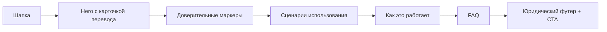
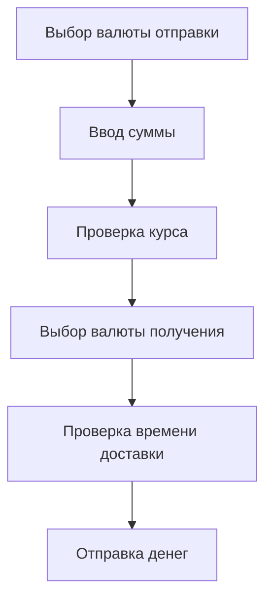
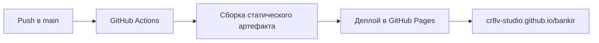

# BANKIR

Статическая лендинговая страница для fintech-продукта международных переводов. Проект показывает быстрый сценарий перевода с карты на карту через Visa, Mastercard и UnionPay: от выбора валюты до подтверждения суммы и времени доставки.

[Открыть сайт](https://cr8v-studio.github.io/bankir/)

<p>
  
  
  
  
</p>

## Кратко о проекте

| Продукт | Формат | Технологии | Деплой |
| --- | --- | --- | --- |
| Международные переводы на карты | Адаптивный лендинг | HTML, CSS, JavaScript | GitHub Pages |

| Доверие | Визуальный маркер | Смысл |
| --- | --- | --- |
|  | Лицензия | DMCC-лицензия платежной компании |
|  | География | Переводы в 190+ стран |
|  | Прозрачность | Итоговая сумма видна до подтверждения |

## Визуальная система

| Элемент | Пример | Роль в интерфейсе |
| --- | --- | --- |
| Основной цвет | `#068760` | CTA, иконки, акцентные блоки |
| Типографика | Manrope | Современный продуктовый fintech-тон |
| Карточки | Поля перевода, баланс, FAQ | Повторяемые UI-модули |
| Motion | Hover, нажатие, раскрытие FAQ | Легкая обратная связь без тяжелых библиотек |

## Структура страницы



## Пользовательский сценарий



## Примеры визуала

| Карточка перевода | Сценарии | Глобальный охват |
| --- | --- | --- |
|  RUB →  USD |  Семья и друзья <br> Переезд <br> Оплата услуг |  |

## Архитектура файлов

```text
.
|-- index.html
|-- css/styles.css
|-- js/main.js
|-- assets/
|   |-- flags/
|   |-- icons/
|   `-- images/
`-- .github/workflows/pages.yml
```

## Локальный просмотр

```bash
python3 -m http.server 4173
```

Открыть в браузере:

```text
http://127.0.0.1:4173/
```

## Публикация

Проект автоматически публикуется через GitHub Actions на GitHub Pages при каждом push в `main`.


