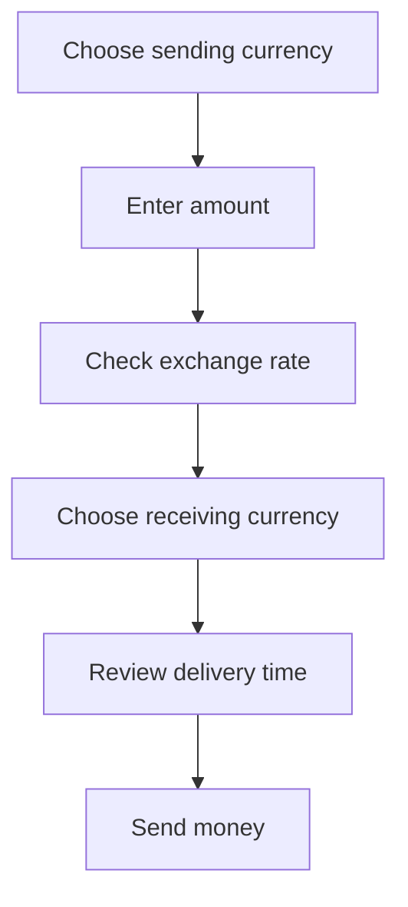

# BANKIR

Static landing page for an international money transfer product. The page presents a fast card-to-card transfer flow for Visa, Mastercard and UnionPay with a clean fintech visual system.

[Live page](https://cr8v-studio.github.io/bankir/)

<p>
  
  
  
  
</p>

## Project Snapshot

| Product | Format | Stack | Deployment |
| --- | --- | --- | --- |
| International card transfers | Responsive landing page | HTML, CSS, JavaScript | GitHub Pages |

| Key proof | Visual cue | Message |
| --- | --- | --- |
|  | License | DMCC licensed payment company |
|  | Coverage | Transfers to 190+ countries |
|  | Pricing | No hidden fees before confirmation |

## Visual System

| Element | Example | Role |
| --- | --- | --- |
| Brand color | `#068760` | Primary CTA, icons, accent blocks |
| Typography | Manrope | Modern product interface tone |
| Cards | Transfer fields, balance cards, FAQ | Reusable product UI modules |
| Motion | Hover, press, FAQ open states | Lightweight feedback without heavy scripts |

## Page Structure


## Transfer Flow



## UI Examples

| Transfer card | Use-case icons | Global visual |
| --- | --- | --- |
|  RUB to  USD |  Family <br> Relocation <br> Services |  |

## Files

```text
.
|-- index.html
|-- css/styles.css
|-- js/main.js
|-- assets/
|   |-- flags/
|   |-- icons/
|   `-- images/
`-- .github/workflows/pages.yml
```

## Local Preview

```bash
python3 -m http.server 4173
```

Open:

```text
http://127.0.0.1:4173/
```

## Deployment

The project is deployed by GitHub Actions to GitHub Pages on every push to `main`.


